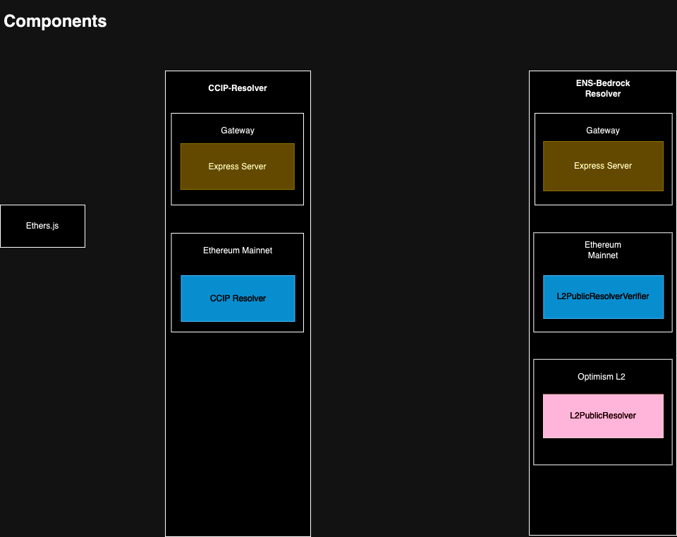
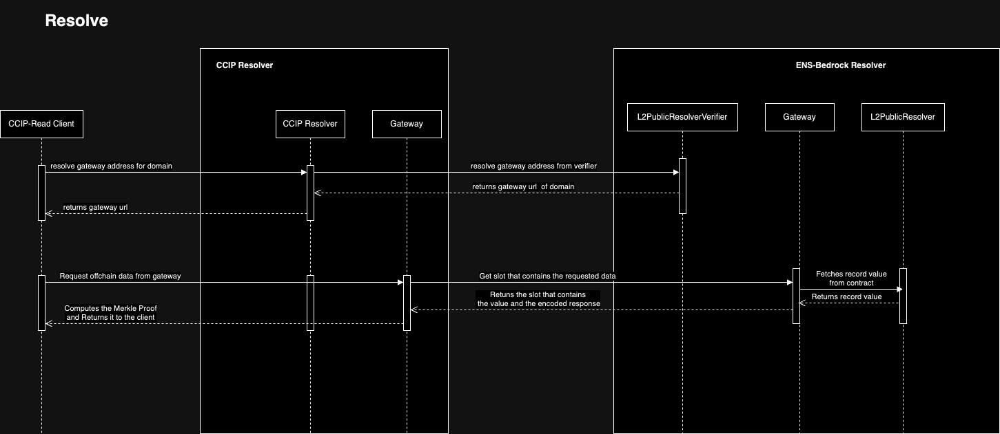
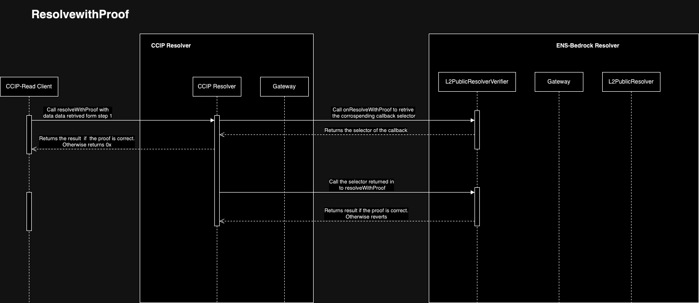

# ENS-Bedrock-Resolver

This repository contains an app specific handler allowing to store ENS records on Optimism.
This repository contains contract that have to be deployed on Optimism and Ethereum aswell as a Gateway to resolve CCIP requests.
Everything is configured already so to set it up you just have to follow the config Setup section

# Contracts

## L2PubicResolver (L2)

The L2PublicResolver is a Smart Contract derived from the ENS PublicResolver implementation. The functionality for setting records remains consistent with the original implementation. However, when retrieving a record, the caller is required to provide context, specifically the address of the record as per the ENS registry.

This feature empowers record owners to securely set their records without needing direct access to the ENS Registry contract deployed on the Ethereum mainnet. By incorporating this mechanism, record owners can confidently manage their records in a trustless manner on Layer 2 solutions.

### Context

The L2PublicResolver introduces a novel approach to record management by utilizing an arbitrary bytes string called "context" to define the namespace to which a record belongs. Specifically, in the context of the L2PublicResolver, this "context" refers to the address of the entity that has set a particular record.

This allows for a more flexible and secure record-setting process, enabling record owners to establish records within their respective namespaces without direct access to the ENS Registry contract on the Ethereum mainnet. By associating records with specific addresses, users can confidently manage their records in a trustless manner on Layer 2 solutions.

#### Set record with Context

The following example shows how a record can be set. Note that the contract will store both records regardless of them being dedicated to the same domain address and key.

This behavior varies from the original PublicResolver implementation, which would revert if msg.sender is not the owner.

```solidity
address owner = 0x1;
address rando = 0x2

//Called by 0x1
L2Publicresolver.setText("alice.eth","my-key","foo");

//Called by 0x2
L2Publicresolver.setText("alice.eth","my-key","bar");

```

#### Read record with Context

When retrieving the record from L2, the context field includes the owner's address according to the ENS registry. This makes it possible to get the right value back from the resolver.

```solidity
bytes memory owner = 0x1;

bytes memory value = L2Publicresolver.text(owner,"alice.eth","my-key","foo");

//value ==foo

```

### Profiles

The L2PublicResolver supports the following profiles

-   address
-   text
-   abi
-   contentHash
-   dns
-   name

## L2PublicResolverVerifier (L1)

The L2PublicResolverVerifier is a smart contract designed to handle 'resolveWithProof' calls specifically dedicated to the L2PublicResolver contract. It serves as the counterpart of the L2PublicResolver and must be deployed for every new instance of the L2PublicResolver.

The contract inherits from the BedrockCCIP Resolver and overrides 'resolveWithProof' for records that require special handling, such as addresses or ABIs.

# Architecture

The following diagrams show all the steps involved in performing a full CCIP lookup.



## Resolve

Resolution according to ENSIP-10 is utilized to retrieve off-chain data. When calling the 'resolve' method, it reverts with an 'OffchainLookup,' which instructs the CCIP-Read Client on how to retrieve the request.

```solidity
error OffchainLookup(address sender, string[] urls, bytes callData, bytes4 callbackFunction, bytes extraData);
```



## ResolverWithProof

Resolve that the response from the gateway is part of the optimism state and is originated from the resolver contract specified in the Verifier


Resolve with proof might revert due to the following reasons

1. If the proof target address does not match the address specified in the L2PublicResolverVerifier, an error message stating 'proof target does not match resolver' will be displayed. This security measure prevents malicious actors from deploying a different L2PublicResolver contract that could potentially return malicious data.
2. The contract will revert if the state root has not been committed to L1. This situation occurs when the stateRoot has not yet been pushed to the L2OutputOracle contract by the sequencer. It's important to note that it might take up to 30 minutes for a newly set record to become available and be successfully resolved. In that case the contract reverts with 'Account is not part of the provided state root'
3. The proof may also be considered invalid for other reasons, often indicating an error in the gateway.

# Setup Gateway

## Install

1. Clone the repo `git clone git@github.com:corpus-io/ENS-Bedrock-Resolver.git`
2. run `yarn install`
3. Create an Env file using `cp env.example .env`

## Prepare environment

To deploy a new contract or run a script that sets a verifier on L1 (Layer 1), you'll need to provide a `DEPLOYER_PRIVATE_KEY` to sign your transactions.

If you want to use Hardhat validation, you can also provide an `OPTIMISTIC_ETHERSCAN_API_KEY` and `GOERLI_ETHERSCAN_API_KEY`. This API key enables Hardhat to validate transactions using Etherscan.

To run the gateway, you'll need to provide the following information:

-   `L1_PROVIDER_URL`: The RPC provider address for L1 (Layer 1).
-   `L2_PROVIDER_URL`: The RPC provider address for L2 (Layer 2).

Make sure you have the necessary `DEPLOYER_PRIVATE_KEY`, `OPTIMISTIC_ETHERSCAN_API_KEY`, `GOERLI_ETHERSCAN_API_KEY`, `L2_OUTPUT_ORALCE_GOERLI`, `L1_PROVIDER_URL`, `L2_PROVIDER_URL`, `L2_CHAIN_NAME`, and `L2_CHAIN_ID` when deploying a contract, running a script, or running the gateway.

Finally, make sure you have test eth on both l1 and l2 to pay the gas.

-   [Op bridge](https://app.optimism.io/bridge/deposit)
-   [BASE test bridge](https://goerli-bridge.base.org/deposit)

## Deploy contracts

**To use the ENS-Bedrock-Resolver for your ENS name, you need to complete 2 transactions on the mainnet to set it up.**

This step may be omitted when using an instance already deployed. You can find their address in the deployments section.
If you decide to deploy a new instance of the L2PublicResolver, you have to deploy a new L2PublicResolverContract as well.

### BedrockProofVerifier

```
yarn deploy:l1-proof-verifier --network goerli|mainnet
export BEDROCK_PROOF_VERIFIER_ADDRESS=<BEDROCK_PROOF_VERIFIER>
```

### L2PublicResolver

```
yarn deploy:l2-resolver --network optimismGoerli|baseGoerli
export L2_RESOLVER_ADDRESS=<L2_RESOLVER_ADDRESS>
## Set ETH address for test name
ENS_NAME=<ENS_NAME> npx hardhat run ./scripts/setAddr.ts --network <optimismGoerli|baseGoerli>
```

### PublicResolverVerifier

```
yarn deploy:l1-resolver-verifier --network goerli|mainnet
export L2_PUBLIC_RESOLVER_VERIFIER_ADDRESS=<L2_PUBLIC_RESOLVER_VERIFIER_ADDRESS>
```

### Resolver

```
yarn deploy:l1-resolver --network goerli
export ERC3668_RESOLVER_ADDRESS=<ERC3668_RESOLVER_ADDRESS>
```

## Setup Resolver

1. Set `L2_RESOLVER_ADDRESS` environment variable if not set yet
2. Set `ENS_NAME` environment variable with your ENS name you own and set resolver for
3. Set the CCIP-Resolver contract as your resolver:

`npx hardhat run ./scripts/setCcipResolver.ts --network goerli`

## Setup Gateway

To run a gateway perform the following steps, create a .env file and copy the content of env.example and make sure the follwoing fields are set correctly

-   L2_PROVIDER_URL
-   ERC3668_RESOLVER_ADDRESS
-   L2_RESOLVER_ADDRESS
-   L2_CHAIN_ID

```
yarn start
```

## Test if all works

Wait for 30 min to 1 hour after you set eth address on L2 with `setAddr`

```
ENS_NAME=<ENS_NAME> npx hardhat run ./scripts/getAddr.ts --network goerli
```

## Deploy Gateway to Cloud Run

Create a parent folder to clone both Ccip-resolver and ens-bedrock repos, clone both repos into it, then copy `Dockerfile.bundle.example` to the parent as `Dockerfile.bundle`.

```
cp Dockerfile.bundle.example ../Dockerfile.bundle
```

The directory structure should look like this

```
├── Dockerfile.bundle
├── Ccip-Resolver
└── ENS-Bedrock-Resolver
```

Modify the following variables

-   L2_PROVIDER_URL
-   ERC3668_RESOLVER_ADDRESS
-   L2_CHAIN_ID

```bash
gcloud auth login # do CLI login to your gcp if you haven't
gcloud auth configure-docker # let gcloud automatically configure your docker for it's own registry
docker build --platform linux/amd64 -t gcr.io/[YOUR_GCP_PROJECT_ID]/ens-bedrock-resolver -f ./Dockerfile.bundle . # keep platform flag, especially for Apple M1
docker push gcr.io/[YOUR_GCP_PROJECT_ID]/ens-bedrock-resolver # do not forget to update project id
```

-   Go to container registry under your project id in GCP
-   Click to the image folder and image itself, you'll see deploy options above image details
-   Be sure port is 8081 when deploying into the Run.
-   (optional) to avoid cold start time, you can set "Minimum number of instances" as 1, under autoscaling options.

Once you find out your gateway URL,

-   Update DEFAULT_VERIFIER_URL variable and redeploy resolver by running `deploy:l1-resolver`
-   Update ERC3668_RESOLVER_ADDRESS on Docker config and redeploy the gateway
-   Set ENS_NAME to new resolver

### Updating

# Deployments

## Goerli

ERC3668Resolver : 0xc7F7528126C80341bB3340b73c72EFA4d1779d20
L2PublicResolverVerifier : 0x8C838DE92b0f663aDAa70a711b3580eC86077485


## Optimsim Goerli

L2PublicResolver: 0x128024860A95A9Da90c38A5a0C9288BA0F0dC8e8
